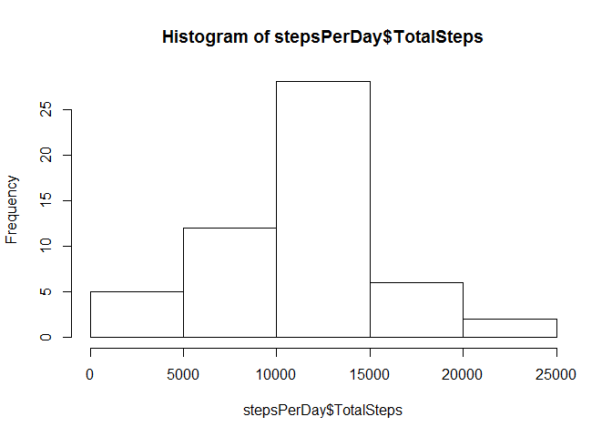
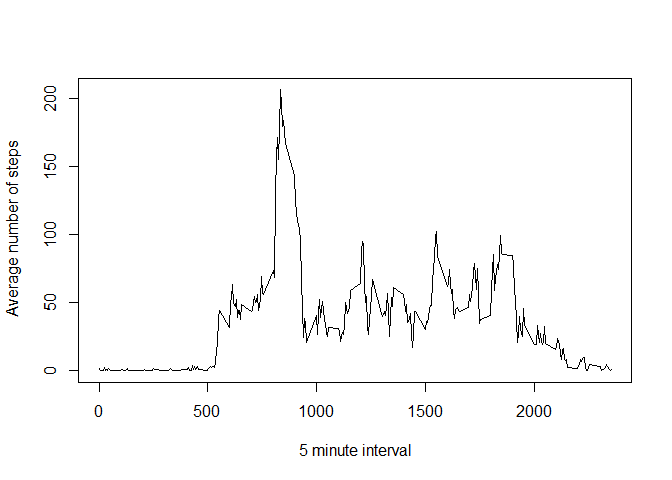
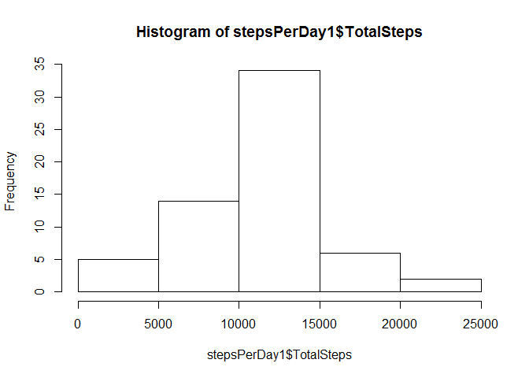
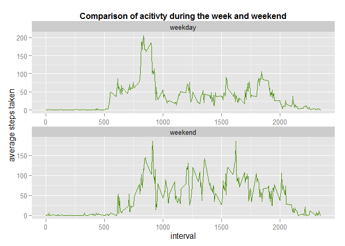

## Reproducible Research Project 1

#### 1. Load data, R packages and process data


```r
# Load library packages used in the script
library(plyr)
library(mice)
```

```
## Warning: package 'mice' was built under R version 3.2.3
```

```
## Loading required package: Rcpp
## mice 2.25 2015-11-09
```

```r
library(ggplot2)

# clear working environment
rm(list=ls())

# set working directory and read data into R
setwd("C:/Users/mskead/Google Drive/Data Science Course/Reproducible Research")
activity <- read.csv("activity.csv")

# get summary of data and see if there are any missing values
summary(activity)
```

```
##      steps                date          interval     
##  Min.   :  0.00   2012-10-01:  288   Min.   :   0.0  
##  1st Qu.:  0.00   2012-10-02:  288   1st Qu.: 588.8  
##  Median :  0.00   2012-10-03:  288   Median :1177.5  
##  Mean   : 37.38   2012-10-04:  288   Mean   :1177.5  
##  3rd Qu.: 12.00   2012-10-05:  288   3rd Qu.:1766.2  
##  Max.   :806.00   2012-10-06:  288   Max.   :2355.0  
##  NA's   :2304     (Other)   :15840
```

```r
# NA's = 2304 

# Trasform data so that it is in a usable format
# change date format 
activity$date <- as.Date(activity$date)

# remove NA's keeping first dataset intact so that data can be added later
activity1 <- na.omit(activity)
```

#### 2. Find the mean total number of steps taken per day.

  2.1 Calculate the total number of steps taken per day.

```r
stepsPerDay <- ddply(activity1, "date", summarize, TotalSteps = sum(steps))
```

  2.2 Make a histogram of the total number of steps taken per day.


```r
hist(stepsPerDay$TotalSteps)
```

 
  2.3 Calculate and report the mean and median of the total number of steps taken
  per day. We find that the mean of the total steps take each day is 10766.19 and
  the median is 10765


```r
#calculate the mean and median of total steps take each day
mean(stepsPerDay$TotalSteps)
```

```
## [1] 10766.19
```

```r
median(stepsPerDay$TotalSteps)
```

```
## [1] 10765
```

#### 3. Investigate that average daily activity pattern.

  3.1 Make a time series plot of the 5-minute interval (x-axis) and the average
  number of steps taken, averaged across all days (y-axis)


```r
# Prepare data and then plot it
averageSteps <- ddply(activity1, "interval", summarize, AverageSteps = mean(steps))
plot(averageSteps, type = "l", xlab = "5 minute interval", ylab = " Average number of steps")
```

 

  3.2 We find that line 16492 steps (806), date (2012-11-27), interval (615)
  contains the maximum number of steps.


```r
maxInterval <- activity1[activity1$steps==max(activity1$steps),]
maxInterval
```

```
##       steps       date interval
## 16492   806 2012-11-27      615
```

#### 4. Imput the missing values

  4.1 We observed when examining the data earlier that there were 2304 missing
  values coded as NA. As the presence of missing days may introduce bias into some
  caluculations or summaries of the data it is important that these value are
  replaced.

  4.2 The mice R package  is used to imput the missing values. This package imputs
  missing values with plausible data values which are drawn from a distribution
  specifically designed for each missing datapoint. Up to 5 regression models are
  run which are then combined into a single model used to imput the missing
  values. In this instance 3 models were run and then combined.


```r
# subset the activity data to leave out the date variable as all values have to be numeric and use the mice package to replace NA values 

newdata <- subset(activity, select = c(steps, interval))

mydata = mice(newdata, m=3, printFlag=FALSE, maxit = 40, seed=2525)
completedData <- complete(mydata,1)
```

  4.3 Create a new dataset that is equal to the original dataset but with the
  missing data filled in.


```r
#combine the new imput data with the original data and remove duplicate columns
finalActivity <- cbind(completedData, activity)
finalActivity <- subset(finalActivity, select = c(steps, interval, date))
```

  4.4 Make a histogram of the total number of steps taken each day and calculate
  and report the mean and median of steps taken per day.


```r
# Prepare data and make a histogram
stepsPerDay1 <- ddply(finalActivity, "date", summarize, TotalSteps = sum(steps))
hist(stepsPerDay1$TotalSteps)
```

 

```r
#calculate the mean and median of total steps taken each day of new completed dataset
mean(stepsPerDay1$TotalSteps)
```

```
## [1] 10894.66
```

```r
median(stepsPerDay1$TotalSteps)
```

```
## [1] 11015
```

We find that the mean and median of the steps taken per day is 10894.66 and 11015 respectively. These values differ from those of the data containing missing values(mean 10766.19 and median 10765) an increase of 1.1862% for the mean value and 2.2957% for the median value.

#### 5. Examine whether there are differences in activity patterns between weekdays and weekends.

  5.1 Create a new factor variable in the dataset with two levels - "weekday" and
  "weekend" indicating whether a given date is a weekday or weekend day.


```r
# use a for loop to allocate days of the week to the data and add a new weekday column
for (i in 1:nrow(finalActivity)) {
        if (weekdays(finalActivity$date[i]) == "Saturday" | weekdays(finalActivity$date[i]) == "Sunday") {
                finalActivity$weekday[i] = "weekend"
        } else {
                finalActivity$weekday[i] = "weekday"
        }
}

head(finalActivity)
```

```
##   steps interval       date weekday
## 1     0        0 2012-10-01 weekday
## 2     0        5 2012-10-01 weekday
## 3     0       10 2012-10-01 weekday
## 4     0       15 2012-10-01 weekday
## 5     0       20 2012-10-01 weekday
## 6     0       25 2012-10-01 weekday
```

```r
# Create a new factor variable in the dataset with two levels - "weekday" and "weekend" indicating whether a given date is a weekday or weekend day. 
finalActivity[, "day"] <- factor(finalActivity$weekday)
```

  5.2 Make a panel plot containing a time series plot of the 5-minute interval
  (x-axis) and the average number of steps taken, averaged across all weekday days
  or weekend days (y-axis).


```r
steps <- aggregate(steps ~ interval + day, finalActivity, mean)

g <- ggplot(steps, aes(interval,steps))+geom_line(color="chartreuse4")+
        facet_wrap(~day, ncol=1, scales="free") + labs(y = "average steps taken", title = 'Comparison of acitivty during the week and weekend') + theme(plot.title = element_text(size=12, face="bold"))
g
```

 


We find that more activity takes place over the weekend.
